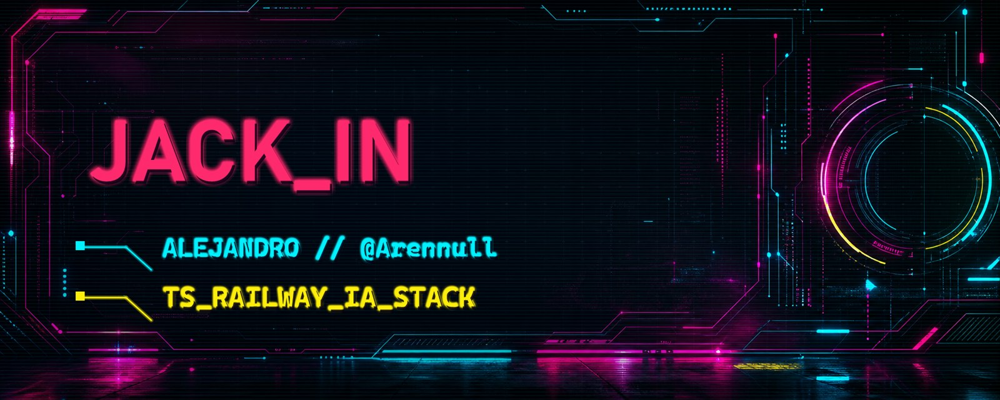
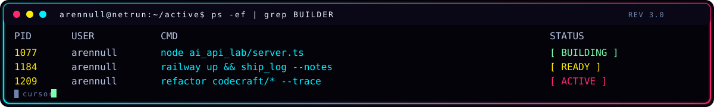
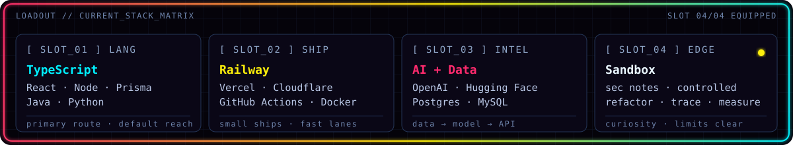

<!--
  ╔══════════════════════════════════════════════════════════╗
  ║   ARENNULL // NETRUNNER PROFILE  //  CYBERPUNK_PRO v3.1  ║
  ║   you found the source. stay chrome.                     ║
  ╚══════════════════════════════════════════════════════════╝
-->

<picture>
  <source srcset="assets/banner-v3.svg" type="image/svg+xml">
  
</picture>

## `// NETRUNNER_DOSSIER`

**ES** — Soy **Alejandro / @Arennull**, estudiante de **DAM** y constructor en modo laboratorio. Me muevo entre **TypeScript**, **Railway** e **IA**; aprendo rompiendo cosas en sandbox, midiendo qué falla y volviéndolas a montar con más criterio. Stack abierto, código limpio, sistemas trazables.

**EN** — DAM student exploring **AI**, **automation**, **data**, **APIs** and pragmatic cloud deploys. TypeScript and Railway are the usual route; the stack changes when the mission asks for it.

## `// ACTIVE_LABS`

No vendo repos que todavía no existen. Esto es el radar real: líneas de trabajo, pruebas y zonas donde estoy metiendo horas.

| Lab | Estado | Señal técnica |
|---|---|---|
| **AI_SYSTEMS** | `[BUILDING]` | OpenAI · Hugging Face · prompts · eval · traza |
| **SHIP_MODE**  | `[READY]`    | Railway · Vercel · Cloudflare |
| **CODECRAFT**  | `[ACTIVE]`   | TypeScript · React · Prisma · refactors |
| **SEC_SANDBOX**| `[CONTROLLED]` | pruebas controladas · límites claros · docs mínimas |

## `// NEXT_BUILDS`

- `AI_API_LAB` — mini APIs con IA donde se sigue el camino dato → modelo → respuesta.
- `RAILWAY_SHIP_LOG` — despliegues pequeños documentados como bitácora técnica.
- `DASHBOARD_NODE` — paneles simples para datos, métricas o automatizaciones.
- `SECURITY_NOTES` — apuntes de sandbox y aprendizaje sin vender humo.

  

## `// STACK_MATRIX`

**Core actual:** TypeScript para ordenar ideas, Railway para ponerlas en línea, IA/datos para convertir curiosidad en sistemas que respondan. Los badges de abajo son mapa visual, no catálogo cerrado.

**Frontend**

**Backend / Data**

**Cloud / Tooling**

**AI / Creative**

## `// UPLINK_SOCIALS`

  

## `// GITHUB_TELEMETRY`

<table>
<tr>
<td align="center" valign="top" width="50%">
  
</td>
<td align="center" valign="top" width="50%">
  
</td>
</tr>
<tr>
<td align="center" valign="top" width="50%">
  
</td>
<td align="center" valign="top" width="50%">
  
</td>
</tr>
</table>

Cards: <a href="https://github.com/anuraghazra/github-readme-stats">github-readme-stats</a> · <a href="https://github.com/DenverCoder1/github-readme-streak-stats">streak-stats</a> · <a href="https://github.com/ryo-ma/github-profile-trophy">profile-trophy</a> · <a href="https://github.com/lowlighter/metrics">metrics</a>. Badges: <a href="https://shields.io">Shields.io</a>. WakaTime via <a href="https://wakatime.com/@Arennull">@Arennull</a>.

## `// CONTRIBUTION_GRID // SNAKE_PROTOCOL`

SVG generado por workflow: <code>Actions → Update contribution snake → Run workflow</code> (cron diario 05:00 UTC).

<strong><code>// DEEP_NET // OPERATING_NOTES</code></strong>

### Protocolos

- **Datos → modelo → API:** si no hay trazabilidad, no hay run.
- **Automatizar con cabeza:** primero entender, luego script.
- **Docs mínimas:** lo justo para que el yo del futuro no pierda el hilo.
- **Sandbox primero:** probar, medir, romper controlado, reconstruir mejor.

### Mental stack

- IDE tuneado, pestañas infinitas y curiosidad en modo alto voltaje.
- Preferencia por sistemas pequeños que se pueden entender, desplegar y mejorar.
- Cuando algo escala, escala con razón — no por estética.

### Field manual

- **Snake grid:** se regenera solo (cron diario 05:00 UTC) y a mano con `Actions → Update contribution snake → Run workflow`.
- **Metrics SVG:** cron semanal lunes 06:00 UTC. Requiere secret `METRICS_TOKEN` (PAT con `repo` + `read:user`).
- **Banner SVG:** edita `assets/banner-v3.svg` directamente; el JPG queda como fallback dentro del `<picture>`.
- **Bitácora:** revisiones en [`CHANGELOG.md`](CHANGELOG.md).

---

<code>README compiled manually // CYBERPUNK_PRO_v3.1 // no fake hype // stay chrome</code>

