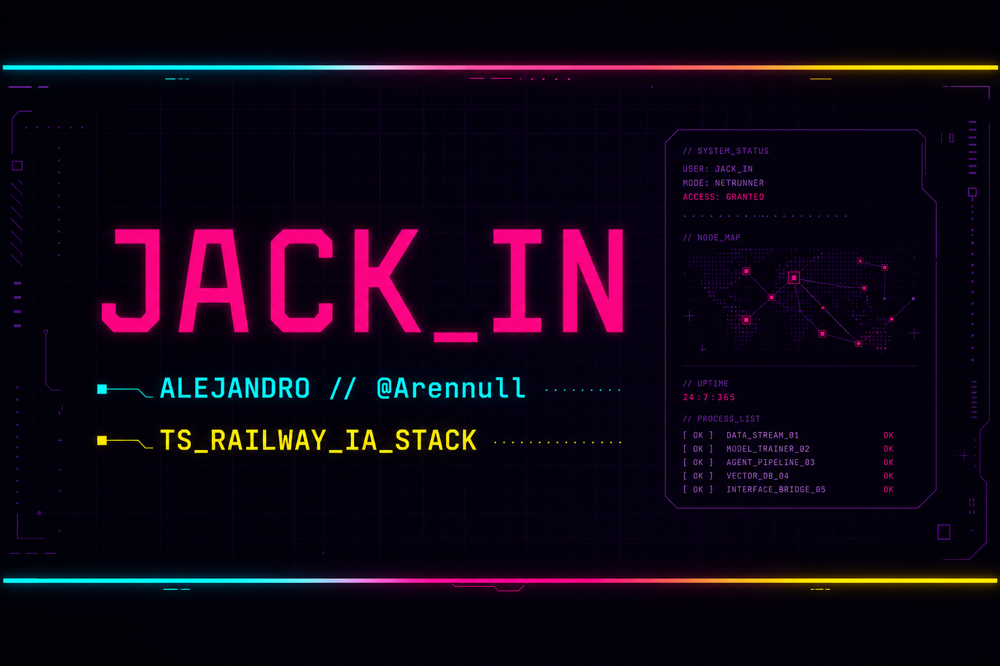

<pre>
╔══════════════════════════════════════════════════════════════════════════╗
║  NETWATCH  ::  HANDLE @Arennull  ::  CLASS NETRUNNER / STUDENT DAMP      ║
╠══════════════════════════════════════════════════════════════════════════╣
║  JACK_IN   TS_PIPELINE   RAILWAY_DEPLOY   IA_SUBSYSTEM   REPOS_ONLY_ICE  ║
╚══════════════════════════════════════════════════════════════════════════╝
</pre>

---

## `// NETRUNNER_DOSSIER`

> **ES:** Estudio **DAM**. Me muevo entre **IA**, **seguridad** y **automatización**; me gusta romper cosas en sandbox y volver a montarlas. **TypeScript** y **Railway** son de lo que más cojo el día a día, pero el stack cambia con el repo — nada de lista cerrada.

> **EN:** DAMP student. **AI**, **cybersecurity**, **automation**. **TypeScript** and **Railway** are usual suspects; everything else depends on the project.

### `// ACTIVE_RUN`

- Código y refactors donde **TypeScript** aporta claridad.
- **Railway** (y lo que toque en cloud) cuando toca sacar algo a producción sin complicarse.
- Pruebas con **IA + datos + APIs** cuando surge la idea.

---

## `// UPLINK_SOCIALS`

---

## `// STACK_MATRIX`

Lo que más suelo tocar —**y si el proyecto pide otra cosa, se suma**. Badges como atajo visual, no como catálogo cerrado.

**TypeScript · Railway** — suelen ser el hilo conductor; el resto va por bloques.

**FRONTEND**

**BACKEND / DATOS**

**CLOUD / TOOLING**

**IA / CREATIVE**

---

## `// GITHUB_TELEMETRY`

<!-- github-readme-stats.vercel.app pausado (503); nirzak-streak 402. Perfil-summary-cards + streak Demolab. -->

<table>
<tr>
<td align="center" valign="top" width="52%">
  
    
  
</td>
<td align="center" valign="top" width="48%">
  
</td>
</tr>
</table>

Stats e idiomas: <a href="https://github.com/vn7n24fzkq/github-profile-summary-cards">github-profile-summary-cards</a>. Racha: <a href="https://github.com/DenverCoder1/github-readme-streak-stats">streak-stats.demolab.com</a>.

---

## `// CONTRIBUTION_GRID // SNAKE_PROTOCOL`

*SVG generado por workflow. **Actions → Update contribution snake → Run workflow** si hace falta regenerar.*

---

<strong><code>// DEEP_NET // FRIKI_LAYER</code></strong>

### Cita (canal alterno)

### Protocolos que sigo

- **Datos → modelo → API:** sin humo; si no hay trazabilidad, no hay run.
- **Automatizar** con cabeza: primero entender, luego script.
- **Docs mínimas** para que el yo del futuro no pierda el hilo en la red.

### Chasis mental

- IDE cargado de extensiones: **overclock** aceptado.
- Pestañas infinitas: **RAM social** en crítico permanente.

---

<code>README compiled manually // NO_CORP_TEMPLATE // stay chrome, choom</code>

