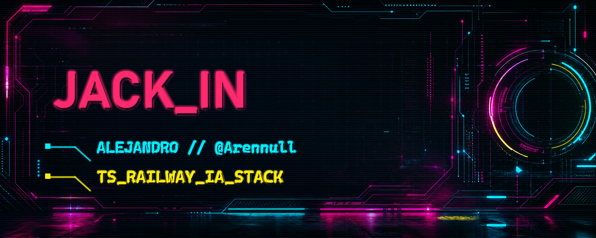

<div align="center">



[](https://github.com/Arennull)

[](https://github.com/Arennull)
[](#netrunner-dossier)
[](#stack-matrix)


</div>

<a id="netrunner-dossier"></a>

## `// NETRUNNER_DOSSIER`

**ES:** Soy **Alejandro / @Arennull**, estudiante de **DAM** y constructor en modo laboratorio. Me muevo entre **TypeScript**, **Railway**, **IA**, datos, APIs y automatización; aprendo rompiendo cosas en sandbox, midiendo qué falla y volviéndolas a montar con más criterio.

**EN:** DAM student exploring **AI**, **automation**, **data**, **APIs** and pragmatic cloud deploys. TypeScript and Railway are the usual route; the stack changes when the mission asks for it.

```txt
STATUS      online
MODE        student_builder
SIGNAL      TypeScript / Railway / AI / data
RULE        clear code, traceable systems, zero fake hype
```

## `// ACTIVE_LABS`

No vendo repos que todavía no existen. Aquí va el radar real: líneas de trabajo, pruebas y zonas donde estoy metiendo horas.

| Canal | Qué estoy afinando | Señal técnica |
| --- | --- | --- |
| `AI_SYSTEMS` | Ideas con IA, datos y APIs útiles | OpenAI, Hugging Face, prompts, evaluación |
| `SHIP_MODE` | Deploys simples para sacar prototipos | Railway, Vercel, Cloudflare |
| `CODECRAFT` | Refactors, estructura y claridad | TypeScript, React, Prisma |
| `SEC_SANDBOX` | Curiosidad por seguridad sin humo | pruebas controladas, trazabilidad, docs mínimas |

<div align="center">
  
</div>

<a id="stack-matrix"></a>

## `// STACK_MATRIX`

**Core actual:** TypeScript para ordenar ideas, Railway para ponerlas en línea, IA/datos para convertir curiosidad en sistemas que respondan.

**Frontend**


**Backend / Data**


**Cloud / Tooling**


**AI / Creative**


## `// UPLINK_SOCIALS`

[](https://instagram.com/al_ext.f)
[](https://linkedin.com/in/Alejandro-Tiscar-Felix)
[](mailto:alejandrotiscarfelix@gmail.com)

<div align="center">
  
</div>

## `// GITHUB_TELEMETRY`

<table>
<tr>
<td align="center" valign="top" width="50%">
  
</td>
<td align="center" valign="top" width="50%">
  
</td>
</tr>
</table>

<sub>Stats: <a href="https://github.com/vn7n24fzkq/github-profile-summary-cards">github-profile-summary-cards</a>. Badges: <a href="https://shields.io">Shields.io</a>.</sub>

## `// CONTRIBUTION_GRID // SNAKE_PROTOCOL`

<div align="center">


<sub>SVG generado por workflow: <code>Actions -&gt; Update contribution snake -&gt; Run workflow</code>.</sub>

</div>

<details>
<summary><strong><code>// DEEP_NET // OPERATING_NOTES</code></strong></summary>

### Protocolos

- **Datos -> modelo -> API:** si no hay trazabilidad, no hay run.
- **Automatizar con cabeza:** primero entender, luego script.
- **Docs mínimas:** lo justo para que el yo del futuro no pierda el hilo.
- **Sandbox primero:** probar, medir, romper controlado, reconstruir mejor.

### Mental stack

- IDE tuneado, pestañas infinitas y curiosidad en modo alto voltaje.
- Preferencia por sistemas pequeños que se pueden entender, desplegar y mejorar.

</details>

---

<div align="center">

<sub><code>README compiled manually // CYBERPUNK_PRO // no fake hype // stay chrome</code></sub>

</div>
