<!-- Profile README — generated from the toolkit in scripts/. Clean · monochrome. -->

# Alejandro

`AI Builder` · `Full-Stack Dev` · `DAM Student`

<table>
  <tr>
    <td valign="top"></td>
    <td valign="top"></td>
  </tr>
</table>

[ LinkedIn ](https://linkedin.com/in/Alejandro-Tiscar-Felix) · [ GitHub ](https://github.com/Arennull)

Portrait + info card render once from <code>scripts/</code>; the heatmap re-scrapes and re-renders daily via GitHub Actions (no auth). README compiled from the toolkit.
