<!-- Profile README — generated from the toolkit in scripts/. Clean · monochrome + 1 accent. -->

<table border="0" cellspacing="10">
  <tr>
    <td valign="top"></td>
    <td valign="top"></td>
  </tr>
</table>

[ LinkedIn ]({{LINKEDIN_URL}}) &nbsp;·&nbsp; [ GitHub ](https://github.com/{{USERNAME}})

Header · portrait · info card render once from <code>scripts/</code>; the heatmap re-scrapes and re-renders daily via GitHub Actions (no auth). README compiled from the toolkit.
